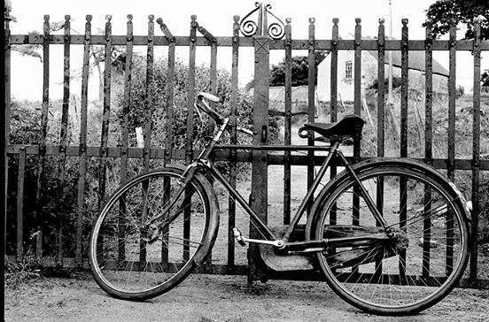

# Stuif csv

## Na Comhaid csv
Baineann na comhaid csv leis na díochlaonta sa Ghaeilge. Is í an fhoirm den
ghinideach uatha a shocraíonn cé acu díochlaonadh a bhfuil sé ann.
- 1ú díochlaonadh - gidideach uatha: consan caol
- 2ú díochlaonadh - ginideacha uatha: cuirtear 'e' leis an bhunfhoirm agus déantar caolú más gá é
- 3ú díochlaonadh - ginideach uatha: cuirtear 'a' leis an bhunfoirm agus déantar leathnú más gá é
- 4ú díochlaodhadh - ní athraíonn an bhunfhoirm sa ghinideach
- 5ú díochlaondadh - ginideach iolra: roinnt dóigheanna lena a dhéanamh le consan leathan
### Samplaí
- 1ú díochlaonadh
- - bád - tóin an bháid - an consan deiridh a chaolú
  - crann - barr an chrainn
  - cat - ruball an chait
- 2ú díochlaonadh
- - gruaig - dath na gruaige - nb. foirm an ailt: na le ginideach uatha baininsceach
  - cos - ladhra na coise
  - fuinneog - gloine na fuinneoige
- 3ú díochlaonadh
- - tincéir - obair an tincéara
  - dochtúir - teach an dochtúra
  - am - i rith an ama
- 4ú díochlaonadh
- - coinín - cluasa an choinín - gan athrú ach amháin séimhiú ar an chonsan i ndiaidh an ailt
  - geafta - datha an gheafta
  - oíche - tús na hoíche - gan athrú ach: alt(leagan bain. gin. uatha) - cuirtear h roimh ghuta
- 5ú díochlaonadh - foirceann le consan leathan
- - cathair - lár na cathrach 
  - comharsa - caint na comharsan
  - cara - dílseacht an charad

## Na Comhaid csv
Úsáidtear liostaí de fhocail sa díochlaonadh i gcomhad csv sa
dóigh gur féidir buneolas gramadaí a aimsiú go gasta.

